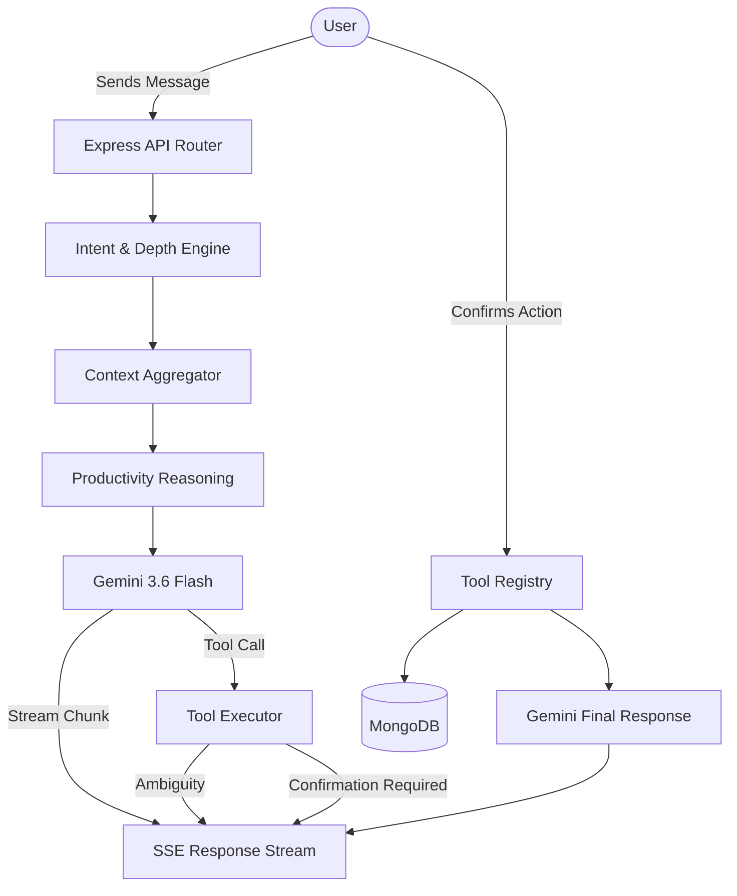

# SIVRA — Personal AI Productivity Companion

SIVRA is a context-aware AI productivity companion built on a MERN (MongoDB, Express, React, Node.js) stack. It goes beyond a simple chat interface by deterministically understanding user intent, retrieving relevant context (tasks, goals, check-ins, and personal memories), and safely proposing verifiable actions against the user's data.

## Overview

SIVRA bridges the gap between a task manager and a conversational assistant. Instead of relying on a generic LLM window that knows nothing about your workload, the SIVRA AI Companion analyzes your actual application data—understanding what is pending, what is overdue, and what your current priorities are—to provide highly personalized planning and productivity reasoning.

---

## Features

### Productivity Management

- **Tasks:** Creation, updating, completion, and prioritization.
- **Goals:** Long-term active goal tracking.
- **Check-ins:** Tracking daily feeling, energy levels, and focus areas.
- **Timeline & Notifications:** Historical activity and user alerts.

### AI Companion

- **Context-Aware Chat:** Conversations grounded in real-time application state.
- **Deterministic Intent Detection:** Classifies user intent (e.g., planning, querying task status, memory saving) using robust heuristics and negation handling.
- **Productivity Reasoning:** Infers workload, overdue risk, and momentum without making medical or psychological claims.
- **Bounded Memory:** Maintains short-term conversation history and extracts deterministic long-term preferences.

### Safe AI Actions

- **Tool Calling:** Supports `createTask`, `completeTask`, `updateTask`, and `createCheckIn`.
- **Natural Language Task Resolution:** Resolves ambiguous references (e.g., "complete the presentation task") to actual database IDs, prompting for clarification if multiple matches exist.
- **Explicit Confirmation:** AI tool calls are staged as pending actions and require explicit user confirmation before database mutation.

### Reliability

- **Progressive Streaming:** Uses Server-Sent Events (SSE) for low-latency chunked responses.
- **Idempotent Execution:** Client-generated message IDs ensure safe retries without duplicating actions.
- **Graceful Degradation:** Specific handling for provider rate limits (429) and service unavailability (503).

---

## AI Architecture

SIVRA employs a staged processing pipeline before the AI model (Gemini) is ever invoked. This ensures the model receives highly relevant, structured context rather than dumping the entire database into the prompt.



---

## Context Engine

The Context Engine (`context.service.ts`) dynamically limits the data provided to the AI based on the detected intent:

- **Minimal Depth:** For simple greetings or memory recall, only high-level signals (e.g., task counts) are fetched.
- **Focused Depth:** For specific queries (e.g., "what's overdue?"), only relevant entities (tasks or goals) are fetched, strictly limited (e.g., top 15 overdue tasks).
- **Deep Depth:** For complex planning requests, a comprehensive but bounded snapshot of today's workload, goals, check-ins, and relevant long-term memories is provided.

---

## Intent Detection

Intent detection (`intent.service.ts`) is deterministic, utilizing a weighted scoring system across exact phrases, multi-word phrases, keywords, and questions.

**Supported Intents:**
`greeting`, `today_focus`, `task_status`, `task_completion`, `overdue_work`, `goal_progress`, `goal_status`, `check_in`, `planning`, `memory_save`, `memory_recall`, and `general`.

**Features:**

- **Negation Handling:** Prevents false positives by detecting negated phrases (e.g., "I am not focused").
- **Confidence Scoring:** Calculates "high", "medium", or "low" confidence to adjust the Context Engine's depth.

---

## Productivity Reasoning

Rather than asking the LLM to guess the user's state, the `reasoning.service.ts` module deterministically derives structured signals from the data:

- **Workload Level:** `light`, `moderate`, `heavy`, `overloaded`.
- **Overdue Risk:** `low`, `moderate`, `high`.
- **Priority Pressure:** `low`, `moderate`, `high`.
- **Momentum:** `unknown`, `steady`, `strong`.
- **Goal Alignment:** `unclear`, `partial`, `aligned`.
- **Detected Patterns:** Explicit warnings (e.g., `high_priority_pressure`, `overdue_backlog`).

---

## Conversation Memory

### Short-Term Conversation History

The most recent 20 messages of the active conversation are retrieved and passed to the model to maintain immediate dialogue continuity.

### Long-Term Personal Memory

Long-term memory extraction (`memory.service.ts`) does **not** rely on expensive vector databases. It uses deterministic pattern matching (e.g., "remember that...", "I prefer...") to save preferences. Memories are categorized (`preference`, `work_style`, `routine`, `response_style`) and retrieved based on the current intent. Current statements directly override older statements using the same semantic key.

---

## Safe Tool Calling

The Companion cannot mutate the database autonomously.

**Registered Tools:**

- `createTask`: Creates a new task with title, priority, and optional due date/goal.
- `completeTask`: Marks a task as completed.
- `updateTask`: Modifies task fields.
- `createCheckIn`: Saves a daily check-in (feeling, energy, focus).

**Security Flow:**

1.  Model emits a tool call block.
2.  Arguments are strictly validated against Zod schemas.
3.  Ownership is implicitly scoped by the authenticated user ID.

---

## Tool Confirmation

When a tool call requires a mutation, it enters the **Confirmation Lifecycle**:

1.  The request is staged in an in-memory `pendingActions` map with a 15-minute expiration.
2.  A `tool_confirmation_required` SSE event is emitted to the client.
3.  The client presents the action.
4.  If the user confirms, the action is consumed idempotently, executed against the database, and the result is fed back into the model to generate a final conversational response.

---

## Natural Language Task Resolution

Users can reference tasks naturally (e.g., "complete the laundry task") without needing database ObjectIDs.
The `tool.executor.ts` layer attempts to resolve the reference:

1.  **Exact Match:** Direct title match resolves instantly.
2.  **Partial Match:** Substring match resolves if unambiguous.
3.  **Ambiguity Detection:** If multiple tasks match, a `tool_ambiguity` SSE event is sent back with candidates, prompting the user for clarification.

---

## Streaming Architecture

SIVRA uses Server-Sent Events (SSE) to provide a fluid, real-time UX.

**Event Lifecycle (`companion.service.ts`):**

- `conversation`: Emits the resolved Conversation ID immediately for client persistence.
- `chunk`: Progressively streams standard text tokens.
- `tool_confirmation_required`: Halts generation and requests user approval.
- `tool_ambiguity`: Halts generation to request clarification on natural language task references.
- `tool_executing` / `tool_result`: Lifecycle events during confirmation.
- `error`: Emitted for failures (e.g., `rate_limited`).
- `done`: Indicates terminal completion of the stream.

---

## Reliability & Error Handling

- **Idempotency:** Client messages provide a `clientMessageId`. The backend ignores duplicate submissions, preventing accidental double-processing during network blips.
- **Provider Errors:** The `@google/genai` SDK errors are intercepted and classified (e.g., 429 becomes `rate_limited`, 503 becomes `service_unavailable`) to provide safe, actionable UI feedback.
- **Stream Interruption:** If the client disconnects (via `AbortSignal`), the stream terminates gracefully without persisting incomplete assistant messages.

---

## Security

- **Authentication:** JWT-based access and refresh tokens (`jsonwebtoken`).
- **Authorization:** All database queries and tool executions are hard-scoped to the authenticated `userId`.
- **Validation:** Incoming payloads and AI-generated tool arguments are parsed via `zod`.
- **HTTP Security:** Handled via `helmet` and `cors`.

---

## Tech Stack

### Frontend

- Next.js 16.3
- React 19.2
- Tailwind CSS 4
- Framer Motion (Animations)
- React Query (@tanstack/react-query)
- React Hook Form + Zod
- React Markdown

### Backend

- Node.js + Express 5.2
- TypeScript
- Mongoose / MongoDB
- @google/genai (Gemini 3.6 Flash)
- Zod

---

## Project Structure

```text
personal-ai-companion/
├── client/                     # Next.js Frontend
│   ├── src/
│   │   ├── hooks/              # Data fetching & SSE streaming (useCompanion)
│   │   └── lib/api/            # API clients
├── server/                     # Express Backend
│   └── src/
│       ├── config/             # Environment & bootstrapping
│       ├── modules/
│       │   ├── auth/           # Authentication & JWT
│       │   ├── checkins/       # Daily check-ins
│       │   ├── companion/      # Core AI architecture
│       │   │   ├── prompts/    # System instructions
│       │   │   ├── services/   # Intent, Context, Reasoning, Memory, Streaming
│       │   │   └── tools/      # Safe tool registry & execution
│       │   ├── goals/          # Goal tracking
│       │   └── tasks/          # Task management
│       └── routes/             # Main Express router
└── scratch/                    # Manual validation scripts
```

---

## Getting Started

### Prerequisites

- Node.js (v20+)
- MongoDB Instance (Local or Atlas)
- Google Gemini API Key

### Backend Setup

1. Navigate to the server directory: `cd server`
2. Install dependencies: `npm install`
3. Configure Environment Variables (see below).
4. Start development server: `npm run dev` (uses `tsx watch`)

### Frontend Setup

1. Navigate to the client directory: `cd client`
2. Install dependencies: `npm install`
3. Start development server: `npm run dev`

### Environment Variables

Create a `.env` file in the `server` directory:

```env
NODE_ENV=development
PORT=5000
CLIENT_URL=http://localhost:3000
MONGODB_URI=YOUR_MONGODB_URI

# Security
JWT_ACCESS_SECRET=YOUR_ACCESS_SECRET
JWT_REFRESH_SECRET=YOUR_REFRESH_SECRET
JWT_ACCESS_EXPIRES_IN=15m
JWT_REFRESH_EXPIRES_IN=7d

# AI Provider
GEMINI_API_KEY=YOUR_GEMINI_API_KEY
```

---

## API Overview

The backend exposes the following RESTful route groups under the main API path:

- `/auth`: Registration, login, and token refresh.
- `/tasks`: CRUD operations for tasks.
- `/goals`: CRUD operations for long-term goals.
- `/check-ins`: Submitting and retrieving daily check-ins.
- `/companion`: Chat initiation, SSE streaming, and tool confirmation endpoints.
- `/timeline`: Historical activity retrieval.
- `/memory`: Management of extracted personal memories.
- `/settings`: User configuration.
- `/notifications`: System and user alerts.

---

## Development Commands

**Client (`client/package.json`):**

- `npm run dev`: Starts the Next.js development server.
- `npm run build`: Builds the application for production.
- `npm run start`: Starts the production server.
- `npm run lint`: Runs ESLint.

**Server (`server/package.json`):**

- `npm run dev`: Starts the server with live reloading via `tsx`.
- `npm run build`: Compiles TypeScript to JavaScript.
- `npm run start`: Runs the compiled server from `/dist`.

---

## Testing

SIVRA currently relies on manual validation and integration test scripts located in the `scratch/` directory. These scripts validate critical AI architecture components, including intent classification accuracy, memory extraction determinism, and streaming payload formats.

---

## Architecture Decisions

- **Backend as the Source of Truth:** The AI model is treated as an untrusted client. The Express backend handles all database queries, enforces tool execution validation, and generates context.
- **Deterministic vs. Semantic Intent:** Utilizing robust heuristics for intent detection (rather than LLM-based categorization) saves token costs, drastically reduces latency, and guarantees predictable behavior.
- **Explicit State Mutation:** To ensure user trust, pending AI actions are staged and explicitly confirmed before execution, preventing hallucinated or undesired database mutations.

---

## Known Limitations

- **In-Memory Action State:** Tool confirmation actions are currently staged in an in-memory `Map`. In a multi-instance deployment (horizontal scaling), this requires sticky sessions or migration to a shared store like Redis.
- **Provider Dependency:** Responsiveness is entirely dependent on the availability and quota of the Google Gemini API.
- **Memory Extraction Constraint:** Long-term memory extraction relies on specific conversational patterns. Subtly phrased preferences may be missed until explicit triggers (e.g., "I prefer...") are used.

---

## License

This project is currently not licensed for redistribution, modification, or commercial use.

All rights reserved.

For permission to use, modify, distribute, or commercially use any part of this project, please contact the author.
